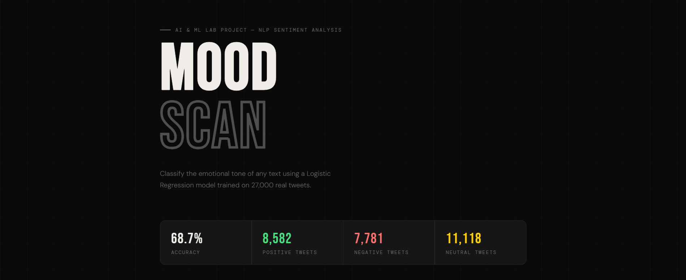
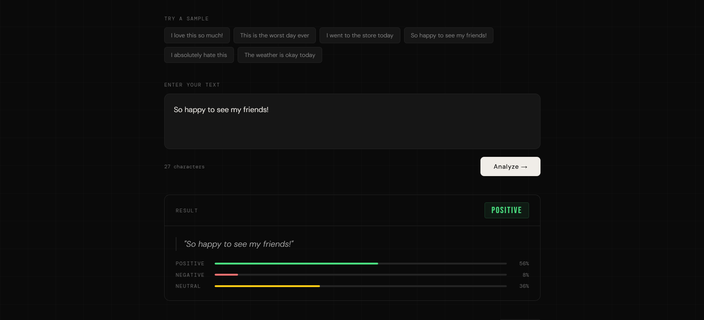
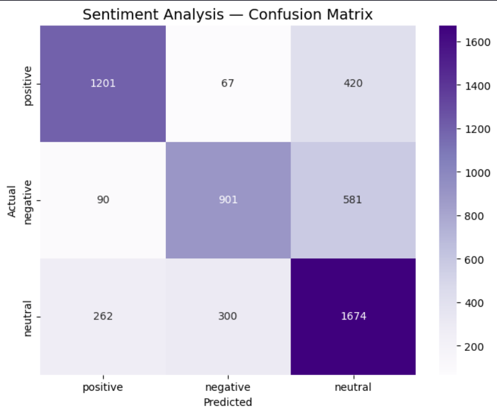
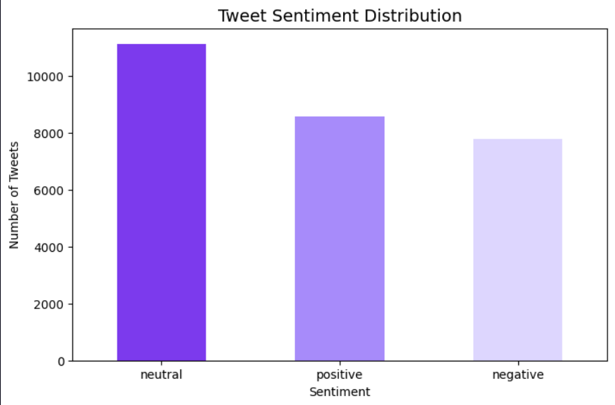

# Sentiment Analysis of Tweets
### AI & ML Lab Project 2026

A machine learning project that classifies tweets as **Positive**, **Negative**, or **Neutral** using NLP techniques and Logistic Regression.

---

## Demo





---

## Visualizations





---

## Results
| Model | Accuracy |
|-------|----------|
| Logistic Regression | **68.70%** |
| Linear SVC | 67.29% |
| Naive Bayes | 63.85% |

---

## Project Structure
```
sentiment-analysis-tweets/
│
├── sentiment.ipynb        ← Main notebook
├── sentiment_ui.html      ← UI Demo
├── README.md              ← This file
├── .gitignore
└── images/
    ├── demo1.png
    ├── demo2.png
    ├── sentiment_analysi.png
    └── sentiment_distribution.png
```

---

## How to Run
1. Clone the repository
2. Download dataset from [Kaggle](https://www.kaggle.com/datasets/yasserh/twitter-tweets-sentiment-dataset) and place `Tweets.csv` in root folder
3. Install dependencies:
```
pip install pandas scikit-learn nltk matplotlib seaborn
```
4. Open `sentiment.ipynb` in Jupyter or VS Code
5. Run all cells

---

## Technologies
- **Python** — core language
- **pandas** — data loading and cleaning
- **NLTK** — text preprocessing
- **scikit-learn** — TF-IDF and ML models
- **matplotlib & seaborn** — visualizations

---

## Key Insights
- Logistic Regression outperformed SVM and Naive Bayes
- Neutral tweets are hardest to classify
- TF-IDF with 5000 features gave best results
- Model achieves 77% precision on positive sentiment

---

## Dataset
- **Source:** [Kaggle Twitter Tweets Sentiment Dataset](https://www.kaggle.com/datasets/yasserh/twitter-tweets-sentiment-dataset)
- **Size:** 27,480 tweets
- **Labels:** Positive, Negative, Neutral
---

## Author
- **Adrija Chakraborty** (06adrija@gmail.com)